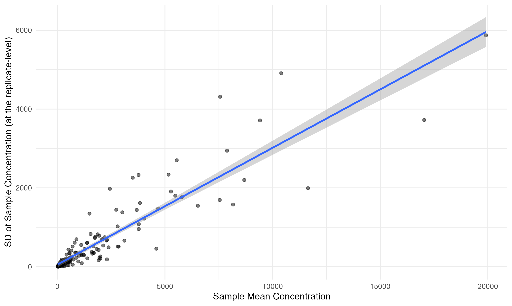
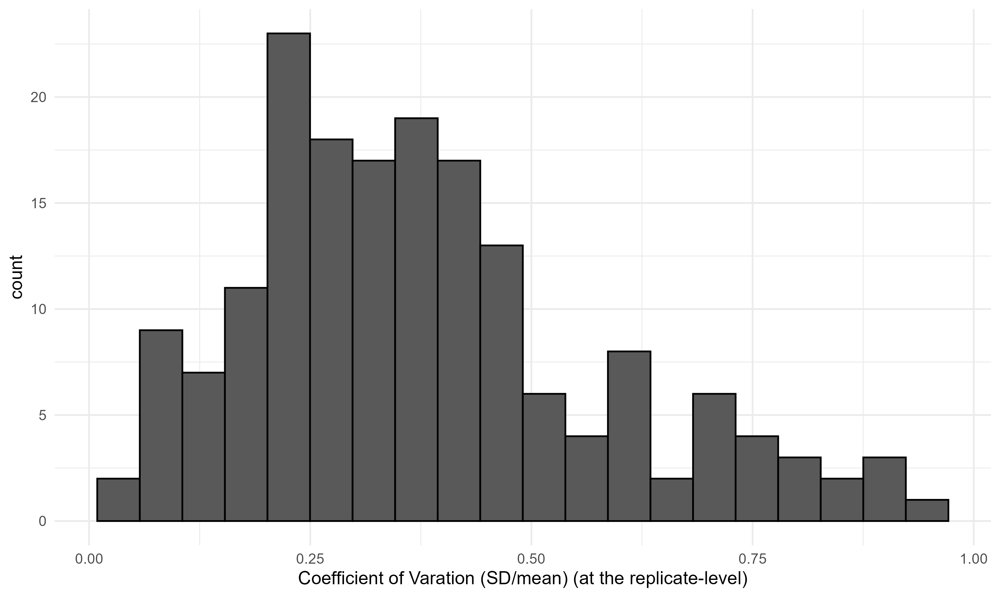

## Background

A colleague asked a seemingly simple question: *"How many water samples would we need to reliably detect a difference in eDNA concentration between a daytime baseline and a nighttime spawning event for a migratory fish species that spawns at night?"*

A seemingly simple question...

So, if you're trying to detect a spawning event using environmental DNA (eDNA), you'd compare daytime baseline concentrations to nighttime concentrations taken during the spawning window. A [2024 paper by Tsuji and Shibata](https://link.springer.com/article/10.1007/s11355-024-00630-9) studying Ayu (*Plecoglossus altivelis*) — an anadromous species — found that eDNA concentrations can be **3x to 10x higher** during active spawning periods compared to baseline. That's a meaningful signal! But can we actually detect it given the noise in our measurements?

That's what this analysis tries to answer.

> **⚠️ Disclaimer:** I want to be upfront — I did not do a deep dive into the "correct" statistical way to approach this. What follows is what came off the top of my head plus a few hours of code. If you're a stats person reading this and thinking *"why did he do it that way?"* — **please reach out!** I'm not an expert in everything, I'm just trying my best, and I would genuinely love to learn a better approach. Send me an email!

---

## The Core Problem: Intra-Sample (Replicate) Measure Variability

Here's the thing about eDNA field sampling: even when you collect multiple replicates at the **same location at the same time**, the measured concentrations can vary quite a bit. That's just the nature of eDNA — it's patchy and in the real world is messy. Their sampling protocol typically collects **3 replicates per sampling event**, to account for this, among other things (better detection probability).

The question is: how much does that within-event variability (i.e., number of replicates) affect our ability to detect a *real* difference between baseline and spawning conditions?

To answer this, I used the **coefficient of variation (CV = SD / mean)** calculated from their existing multi-year dataset as an empirical distribution of measurement noise. The key insight is that rather than assuming a theoretical noise distribution, I used the actual distribution they've observed in the field.

---

## R Package Setup


``` r
library(dplyr)
library(purrr)
library(furrr)
library(tidyr)
library(broom)
library(ggplot2)
```

---

## Characterizing Intra-Sample Variability

They have four years of qPCR eDNA for migratory fish  monitoring (of a certain species) with around 175 sampling events for the location of interest, with more than one replicate. I calculated the mean, standard deviation, and coefficient of variation (CV) of the concentration measurements for each event. This tells us how "noisy" a given sampling event is. 


### Concentration vs. Variability

One useful thing to check: does the *amount* of noise scale with the concentration? In this case, yes, it does. This is very helpful, as it means we can apply this distribution of uncertainty to any concentration quantity (assuming it continues to scale for even larger values).



### Distribution of CV Across Sampling Events

This is the key plot. The histogram below shows the distribution of CVs across all sampling events. **This distribution is what we'll use to simulate noise in the power analysis** — we sample from it empirically, rather than assuming any particular parametric form. In this case, the sampling is a bit noisy, with a median CV of 0.35 and a long right tail.





---

## The Simulation Approach

Here's the methods of the power analysis, laid out plainly:

1. Pick a **baseline eDNA concentration** (we use the median observed concentration).
2. Pick a **multiplier** (e.g., 3x means nighttime spawning concentration is 3× baseline).
3. Pick a **"sample size"** (number of replicates per sampling event).
4. **Simulate** both a "daytime" group and a "nighttime" group by:
   - Drawing a random CV from our empirical distribution for each simulated sample.
   - Generating a noisy concentration measurement: `conc_obs = conc_true + rnorm(0, 1) × (conc_true × CV)`.
5. Run a **t-test** between the two groups and check if p < 0.05.
6. Repeat **5,000 times** (arbitrary, but given our 175 data points, it seems sufficient) and record the proportion of t-tests that came back significant.

That proportion is our estimated **statistical power** — the probability of detecting a real difference given the noise structure we've observed.


### Core Simulation Functions


``` r
# Generate n_samples noisy measurements around a true concentration,
# drawing CVs empirically from cv_vector.
gen_sample <- function(conc, n_samples, cv_vector) {
  cvs     <- sample(cv_vector, n_samples, replace = TRUE)
  sd_vals <- conc * cvs                     # CV -> SD
  z       <- rnorm(n_samples, 0, 1)         # standardized residuals
  samples <- conc + z * sd_vals             # add noise
  samples[samples < 0] <- 0                 # floor at zero (can't have negative conc)
  return(samples)
}


# Build a parameter grid: one row per group (baseline vs. elevated) × n_samples × multiplier.
gen_param_grid <- function(start_conc, mult_vec, n_samples_vec) {
  param_grid <- expand.grid(
    start_conc = start_conc,
    mult       = mult_vec,
    n_samples  = n_samples_vec
  ) %>%
    mutate(end_conc = mult * start_conc)

  # Pivot to long format so each row is one group within a comparison
  grid_long <- pivot_longer(
    param_grid,
    cols     = c(start_conc, end_conc),
    names_to = "group", values_to = "conc"
  ) %>%
    group_by(mult, n_samples) %>%
    mutate(compare_id = cur_group_id()) %>%
    ungroup() %>%
    mutate(row_id = row_number())

  return(grid_long)
}


# For all rows in the parameter grid, generate simulated samples.
gen_sim_data_from_param_grid <- function(param_grid, cv_vector) {
  map_dfr(1:nrow(param_grid), function(row) {
    tibble(
      conc   = gen_sample(param_grid$conc[row], param_grid$n_samples[row], cv_vector),
      row_id = param_grid$row_id[row]
    )
  }) %>%
    left_join(param_grid %>% rename(conc_init = conc), by = "row_id")
}


# Repeat the simulation n_iter times (in parallel if n_cores > 1).
gen_sim_data_from_param_grid_iter <- function(param_grid, cv_vals, n_iter, n_cores = 1) {
  plan(multisession, workers = n_cores)

  iter_out <- future_map_dfr(
    1:n_iter,
    function(iter) {
      gen_sim_data_from_param_grid(param_grid, cv_vals) %>%
        mutate(iteration = iter)
    },
    .options = furrr_options(seed = TRUE)
  )

  plan(sequential)
  return(iter_out)
}


# Run a t-test for each comparison × iteration and summarize power.
run_ttests <- function(iter_out, param_grid, n_cores = 1) {
  plan(multisession, workers = n_cores)

  groups <- iter_out %>% group_split(compare_id, iteration)

  ttests_map <- future_map_dfr(
    groups,
    ~ broom::tidy(t.test(conc ~ group, data = .x)),
    .options = furrr_options(seed = TRUE)
  )

  plan(sequential)

  # Attach metadata back to t-test results
  ttests <- ttests_map %>%
    bind_cols(
      iter_out %>%
        distinct(compare_id, iteration) %>%
        arrange(compare_id, iteration)
    ) %>%
    left_join(
      param_grid %>%
        select(compare_id, n_samples, mult, conc_init = conc) %>%
        distinct(compare_id, mult, .keep_all = TRUE),
      by = "compare_id"
    )

  # Summarize: power = fraction of iterations where p < 0.05
  clean_ttests <- ttests %>%
    group_by(n_samples, mult, conc_init) %>%
    summarise(
      power       = sum(p.value < 0.05) / n(),
      effect_size = sum(estimate2 - estimate1) / n(),
      .groups     = "drop"
    ) %>%
    mutate(
      true_effect       = conc_init * (mult - 1),
      effect_size_error = abs((abs(effect_size) - true_effect) / true_effect)
    )

  return(clean_ttests)
}


# Wrapper: run the full pipeline for a given starting concentration.
fish_power <- function(start_conc, mult_vec, n_samples_vec, cv_vals,
                       n_iterations, n_cores) {
  param_grid  <- gen_param_grid(start_conc, mult_vec, n_samples_vec)
  sim_samples <- gen_sim_data_from_param_grid_iter(param_grid, cv_vals, n_iterations, n_cores)
  t_out       <- run_ttests(sim_samples, param_grid)
  return(t_out)
}
```

---

## Running the Simulation

I pull the empirical CV values from our data and run 5,000 iterations across all combinations of:

- **Multiplier:** 1× through 10× (1× = no difference, as a sanity check)
- **Sample size:** 3 through 18 replicates (in steps of 3, since they usually collect in threes)

I use the **median baseline concentration** — and as we'll see, the baseline concentration turns out not to matter for the results anyway (which, on reflection, makes complete sense once you think about it how they are all drawing from the same CV-based noise).


``` r
# Extract the empirical CV distribution — this is the heart of the simulation
## this will be a vector of the values from the above histogram. 
## you can load in your own values or use the below code to generate a distribution similar to the one I showed above.
cv_vals <- rbeta(175, 2, 4)

hist(cv_vals, breaks = 20)

# Baseline concentration to model (median of all samples)
q50  <- 529
```


``` r
# NOTE: This chunk is computationally intensive (~5000 iterations × 100 param combos).
run_power1 <- fish_power(
  start_conc    = q50,
  mult_vec      = 1:10,
  n_samples_vec = c(3, 6, 9, 12, 15, 18),
  cv_vals       = cv_vals,
  n_iterations  = 5000,
  n_cores       = 32
)

# save output
saveRDS(run_power1, "output.rds")
```

---

## Results: Power Heatmap

The plot below shows estimated statistical power for each combination of number of replicates per event (i.e., number of replicates collected during the day and again at night) (x-axis) and concentration multiplier (y-axis). Green = high power (good!), white/light = low power (bad!).

The value in each cell is the **proportion of 5,000 simulations where a t-test correctly detected a significant difference** between the baseline and elevated concentrations. Think of it as: "if the true multiplier is X and we collect Y replicates for each event, what's the probability we'd actually detect it?"


``` r
run_power1 = readRDS("output.rds")

run_power1 %>%
  ggplot(aes(x = n_samples, y = mult, fill = power)) +
  geom_tile(color = "white", linewidth = 0.5) +
  geom_text(aes(label = round(power, 2)), size = 4) +
  scale_x_continuous(
    breaks = c(3, 6, 9, 12, 15, 18),
    expand = c(0, 0)
  ) +
  scale_y_continuous(
    breaks = 1:10,
    expand = c(0, 0)
  ) +
  scale_fill_fermenter(
    breaks    = c(0.5, 0.75, 0.9, 0.95, 0.99),
    palette   = "Greens",
    direction = 1,
    name      = "Power"
  ) +
  labs(
    x        = "Number of Replicates per Event",
    y        = "Concentration Multiplier (Nighttime / Daytime)",
    title    = "Power Analysis: Detecting eDNA Spawning Signal",
    subtitle = "5,000 simulations per cell | empirical uncertainty around sampling included"
  ) +
  theme_minimal(base_size = 14) +
  theme(
    panel.grid  = element_blank(),
    legend.position = "right"
  )
```

<div class="figure" style="text-align: center">
}}index_files/figure-html/power-heatmap-1.png" alt="Statistical power as a function of sample size and concentration multiplier. Greener = better." width="960" />
<p class="caption"><span id="fig:power-heatmap"></span>Figure 1: Statistical power as a function of sample size and concentration multiplier. Greener = better.</p>
</div>

### What Does This Tell Us?

A few takeaways:

- **At the literature's lower bound (3×):** You need a decent number of replicates to reliably detect the signal. If you're collecting 3 replicates per event (their typical protocol), your power is going to be pretty low — you'll miss real differences more often than not.
- **At the upper bound (10×):** Even a handful of samples gives you very high power (somewhere between 3 and 6). A 10× difference is a big signal, and it cuts through the noise.
- At 1x, we see that the power is roughly 0.05, for any number of replicates, which makes sense given the definition of a p-value.


---

## Does the Baseline Concentration Matter?

I tried this and ... No it does not change the results. The results are essentially identical whether you start from the minimum, median, or maximum observed baseline concentration. This is not surprising — once you express noise as a CV (relative to the mean), the absolute scale drops out. A stats person would probably nod knowingly at this. But, it wasn't initially obvious to me, so I just had to run the simulation to convince myself.

---

## Summary

- The migratory fish species of interest spawns at night, and eDNA concentrations are potentially 3–10× higher during spawning events.
- Our existing data shows substantial intra-sample variability (replicates, as measured by the coefficient of variation), which limits our ability to detect real differences.
- With 3 replicates per event, detection power at any multiplier is low — you'll often miss the signal.
- At moderate multipliers (≥ 3–6×), 6 replicates is likely sufficient.

In a way, **this simulation method I present here, can be used for a variety of cases** where there is a baseline group and an 'experimental' group with an expected change from the baseline, with a known uncertainty in the the measurement of given sample or replicate. To note, I'm not claiming to invent this method (I didn't do any digging!!!) --- I'm just reflecting on the broader applicability of it.

If you want to chat about this analysis — whether to poke holes in the methodology, suggest a better approach, or just geek out about eDNA and fish — please reach out. I'd love to hear from you.

---

## Session Info


```{.r .fold-hide}
sessionInfo()
```

```
## R version 4.3.3 (2024-02-29 ucrt)
## Platform: x86_64-w64-mingw32/x64 (64-bit)
## Running under: Windows 11 x64 (build 26200)
## 
## Matrix products: default
## 
## 
## locale:
## [1] LC_COLLATE=English_United States.utf8 
## [2] LC_CTYPE=English_United States.utf8   
## [3] LC_MONETARY=English_United States.utf8
## [4] LC_NUMERIC=C                          
## [5] LC_TIME=English_United States.utf8    
## 
## time zone: America/New_York
## tzcode source: internal
## 
## attached base packages:
## [1] stats     graphics  grDevices utils     datasets  methods   base     
## 
## other attached packages:
## [1] ggplot2_4.0.1 broom_1.0.7   tidyr_1.3.1   furrr_0.3.1   future_1.34.0
## [6] purrr_1.0.2   dplyr_1.1.4  
## 
## loaded via a namespace (and not attached):
##  [1] gtable_0.3.6       jsonlite_1.8.8     compiler_4.3.3     tidyselect_1.2.1  
##  [5] parallel_4.3.3     jquerylib_0.1.4    scales_1.4.0       globals_0.16.3    
##  [9] yaml_2.3.10        fastmap_1.2.0      R6_2.6.1           generics_0.1.4    
## [13] knitr_1.49         backports_1.5.0    tibble_3.3.1       bookdown_0.46     
## [17] RColorBrewer_1.1-3 bslib_0.8.0        pillar_1.11.1      rlang_1.1.6       
## [21] cachem_1.1.0       xfun_0.49          S7_0.2.1           sass_0.4.9        
## [25] cli_3.6.5          withr_3.0.2        magrittr_2.0.3     grid_4.3.3        
## [29] digest_0.6.37      rstudioapi_0.17.1  lifecycle_1.0.5    vctrs_0.6.5       
## [33] evaluate_1.0.5     glue_1.7.0         farver_2.1.2       blogdown_1.23     
## [37] listenv_0.9.1      codetools_0.2-19   parallelly_1.39.0  rmarkdown_2.29    
## [41] tools_4.3.3        pkgconfig_2.0.3    htmltools_0.5.8.1
```

