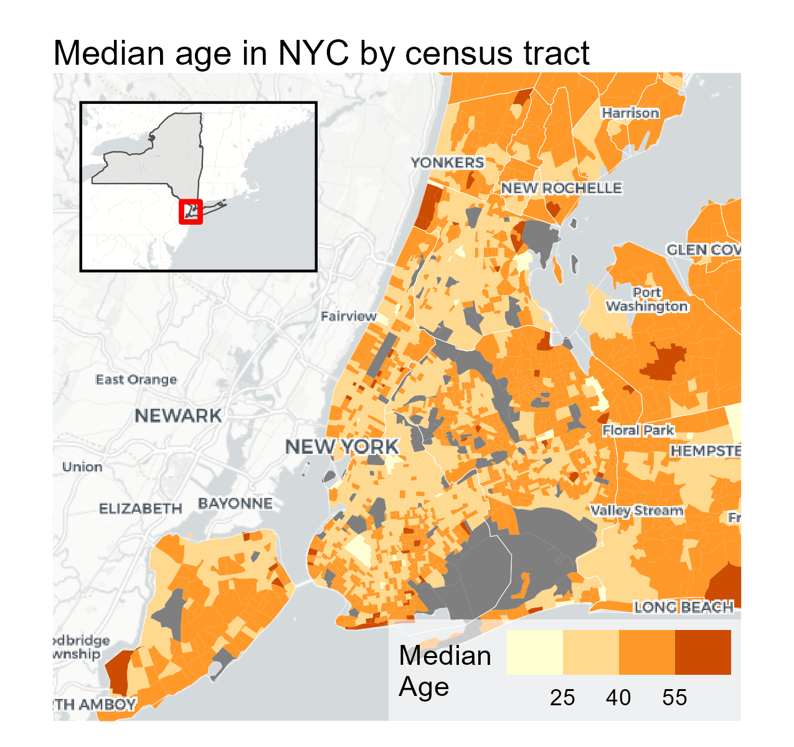

In this post I'll show how to make a choropleth map (ACS census data by tract), layer it over a styled basemap, and add a locator inset — all in ggplot2.

This process results in a map that you could drop straight into a report or paper. The final plot looks like this: 



## Packages


``` r
library(tidycensus)
library(dplyr)
library(sf)
library(ggplot2)
library(scales)
library(ggnewscale)
library(cowplot)
library(basemaps)
library(ggview)
```

The key packages here:

- `tidycensus` — pulls Census/ACS data with geometries directly into R
- `basemaps` — adds basemap tile layers (OpenStreetMap, Carto, Esri, etc.) as ggplot layers, including some have no labels or only-label basemap layers (explained more below).
- `ggnewscale` — required when combining a raster basemap with a spatial fill layer.
- `cowplot` — handles the inset map compositing. 
- `ggview` — a super-handy package for quickly previewing ggplot objects for export. It allows to view the plot as it will appear once exported. This is a constant struggle with ggplot2 exports and is for some reason worse for maps. 

## Getting the Data

I'm pulling three things from the Census API: median age by tract (ACS 2023), county subdivisions (for town/municipality outlines), and the state boundary for the inset.

When composing maps in R, it's similar to composing maps in a dedicated GIS software. You need to get all your layers and data ready first, then do the styling and compositing at the end. So, the three layers needed here are: the census tract data for the choropleth, the county subdivisions for the borders in the main map, and the state boundary for the inset.


``` r
# census_api_key("YOUR_KEY_HERE") # run with your own key

# median age by census tract
ny_age <- get_acs(
  geography = "tract",
  variables = "B01002_001",
  state = "NY",
  year = 2023,
  geometry = TRUE
)

# county subdivisions (towns/municipalities)
ny_subdiv <- get_decennial(
  geography = "county subdivision",
  variables = "P001001",
  state = "NY",
  year = 2010,
  geometry = TRUE
)

# state boundary for inset
ny_state <- get_decennial(
  geography = "state",
  variables = "P001001",
  state = "NY",
  year = 2010,
  geometry = TRUE
)
```

You can get a free Census API key at [api.census.gov](https://api.census.gov/data/key_signup.html).

## Setting the Correct CRS

The `basemaps` package requires layers be in Web Mercator (EPSG:3857) for plotting. I haven't yet found a way to use a basemap layer in a different CRS in ggplot2. Most (all?) are designed for Web Mercator. 


``` r
ny_age <- st_transform(ny_age,   3857)
ny_subdiv <- st_transform(ny_subdiv,       3857)
ny_state <- st_transform(ny_state, 3857)
```


## Defining the Bounding Box

The basemap tile layers are fetched for a specific bounding box. I define the NYC extent in WGS84 (4326) so I can use lat/long and transform it to Web Mercator (3857) for use in ggplot2.


``` r
nyc_bbox_3857 <- st_transform(
  st_as_sfc(
    st_bbox(c(xmin = -74.3, xmax = -73.6,
              ymin = 40.5,  ymax = 41.0), crs = 4326)
  ),
  3857
) %>% st_bbox()
```

## The Main Map

Here is where specifying the order of the layers becomes important. The order that I found works the best is the following: (1) The basemap tiles _without_ labels need to be at the bottom, then (2) the choropleth vector layer, and finally (3) the basemap with _labels only_ on top of everything.

Splitting the basemaps this way seems a little weird or not efficient. BUT, the issue with including a basemap _with labels_ as the first layer is that the labels will be rendered underneath the choropleth layer, which can make them hard to read or get cut off. By splitting the basemap into two layers — one with no labels and one with only labels — we can ensure that the labels are always on top and readable.

The `basemap` package is a little tricky and there is specific syntax that needs to be followed. First, the basemap is added with `basemap_gglayer()`, which is a custom ggplot layer that fetches and renders the tiles. This layer uses `fill` internally, so we need to call `scale_fill_identity()` immediately after to satisfy ggplot's requirement for a fill scale. Then we call `new_scale_fill()` to reset the fill scale so we can use it for the choropleth layer without conflicts. In fact, we need to call `new_scale_fill()` after each ggplot layer to reset the fill scale for the next layer.

To 'zoom' into the region of interest, we set the coordinate system with `coord_sf()`. 


``` r
p1 <- ggplot() +
  
  # basemap: tiles without labels (so labels render on top of the choropleth)
  basemap_gglayer(nyc_bbox_3857, map_service = "carto", map_type = "light_no_labels") +
  scale_fill_identity() +
  new_scale_fill() +
  
  # census tract choropleth
  geom_sf(data = ny_age, aes(fill = estimate), color = NA) +
  geom_sf(data = ny_subdiv, color = "white", fill = NA, linewidth = 0.1) +
  scale_fill_fermenter(
    palette = "YlOrBr",
    direction = 1,
    breaks = c(25, 40, 55),
    name = "Median\nAge"
  ) +
  new_scale_fill() +
  
  # basemap: labels only, rendered on top
  basemap_gglayer(nyc_bbox_3857, map_service = "carto", map_type = "light_only_labels") +
  scale_fill_identity() +
  new_scale_fill() +
  
  coord_sf(
    crs = 3857,
    xlim = c(nyc_bbox_3857["xmin"], nyc_bbox_3857["xmax"]),
    ylim = c(nyc_bbox_3857["ymin"], nyc_bbox_3857["ymax"]),
    expand = FALSE
  ) +
  
  labs(title = "Median age in NYC by census tract") +
  theme_void() +
  theme(
    plot.background = element_rect(fill = "white", color = NA),
    plot.margin = margin(t = 10, r = 10, b = 10, l = 10),
    legend.position      = c(1, 0), # where on the plot the legend is anchored
    legend.justification = c(1, 0), # which corner/point of the legend box itself gets pinned to that position.
    legend.direction     = "horizontal",
    legend.background    = element_rect(fill = alpha("white", 0.6), color = NA),
    legend.margin        = margin(4, 4, 4, 4)  # top, right, bottom, left (pts)
  )
```

```
## Loading basemap 'light_no_labels' from map service 'carto'...
## Loading basemap 'light_only_labels' from map service 'carto'...
```

``` r
p1
```

}}index_files/figure-html/unnamed-chunk-6-1.png" width="672" />

I'm using `scale_fill_fermenter()` here rather than a continuous scale. The binned approach makes differences easier to read in Choropleth maps (most of the time).

## The Inset

The inset shows New York State and surrounding areas with a red bounding box showing where the main map is located. The same tricks are applied here with the basemap layers. The bounding box is added as an `sf` polygon layer on top of the state layer. The red bounding box also needs to have it's own bounding box defined. Another little trick is to add a tiny buffer (+/- 0.2 lat/lon) around the red bounding box so that it appears more clearly once it ultimately gets rendered much tinier as an inset.


``` r
# NYC bounding box as an sf polygon (for the red rectangle)
nyc_bbox <- st_as_sfc(
  st_bbox(c(xmin = -74.3-0.2, xmax = -73.6+0.2,
            ymin = 40.5-0.2,  ymax = 41.0+0.2), crs = 4326)
) %>% st_transform(st_crs(ny_subdiv))

# wider regional extent for the inset basemap
regional_bbox_3857 <- st_transform(
  st_as_sfc(
    st_bbox(c(xmin = -80.5, xmax = -66.5,
              ymin = 38.0,  ymax = 45.5), crs = 4326)
  ),
  3857
) %>% st_bbox()

p2 <- ggplot() +
  
  basemap_gglayer(regional_bbox_3857, map_service = "carto", map_type = "light_no_labels") +
  scale_fill_identity() +
  new_scale_fill() +
  
  geom_sf(data = ny_state, fill = "gray80", color = NA, alpha = 0.5) +
  geom_sf(data = ny_state, fill = NA, color = "gray30", linewidth = 0.25) +
  geom_sf(data = nyc_bbox, fill = NA, color = "red", linewidth = 1) +
  
  coord_sf(expand = FALSE) +
  theme_void() +
  theme(
    panel.border = element_rect(color = "black", fill = NA, linewidth = 1), # black border to pop the inset off the main map
    panel.spacing = unit(0, "pt")
  )
```

```
## Loading basemap 'light_no_labels' from map service 'carto'...
```

``` r
p2
```

}}index_files/figure-html/unnamed-chunk-7-1.png" width="672" />

## Compositing with cowplot

Using cowplot to composite the main map and the inset is pretty straightforward. The main map is added first, then the inset is added on top with `draw_plot()`, where you can specify the position and size of the inset relative to the main plot. The `canvas()` function from the `ggview` package is used to set the overall dimensions of the combined plot. It does take some tinkering with the values for the inset and for the canvas. The upside to using `ggview::canvas()` is that it allows you to preview the plot as it will appear once exported, which is a huge help for dialing in the inset position and size as well as the plot proportions overall. (Many ggplot2 users will know this struggle!!!)


``` r
p_combo <- ggdraw() +
  draw_plot(p1) +
  draw_plot(p2, x = 0.1, y = 0.6, width = 0.3, height = 0.3) + 
  canvas(4.25, 4, units = "in")
```


``` r
p_combo
```


To export the map, you need to use `save_ggplot` from the `ggview` package rather than `ggsave`. This is because `ggview` applies some additional processing to ensure that the plot looks the same in R as it does when exported. 


``` r
save_ggplot(p_combo, file = "featured.png", dpi = 300)
```


## Full Code


``` r
library(tidycensus)
library(dplyr)
library(sf)
library(ggplot2)
library(scales)
library(ggnewscale)
library(cowplot)
library(basemaps)
library(ggview)


# Getting the Data

## # census_api_key("YOUR_KEY_HERE") # run with your own key

## median age by census tract
ny_age <- get_acs(
  geography = "tract",
  variables = "B01002_001",
  state = "NY",
  year = 2023,
  geometry = TRUE
)

## county subdivisions (towns/municipalities)
ny_subdiv <- get_decennial(
  geography = "county subdivision",
  variables = "P001001",
  state = "NY",
  year = 2010,
  geometry = TRUE
)

## state boundary for inset
ny_state <- get_decennial(
  geography = "state",
  variables = "P001001",
  state = "NY",
  year = 2010,
  geometry = TRUE
)

# Setting the Correct CRS
ny_age <- st_transform(ny_age,   3857)
ny_subdiv <- st_transform(ny_subdiv,       3857)
ny_state <- st_transform(ny_state, 3857)

# Defining the Bounding Box
nyc_bbox_3857 <- st_transform(
  st_as_sfc(
    st_bbox(c(xmin = -74.3, xmax = -73.6,
              ymin = 40.5,  ymax = 41.0), crs = 4326)
  ),
  3857
) %>% st_bbox()


# The Main Map
p1 <- ggplot() +
  
  # basemap: tiles without labels (so labels render on top of the choropleth)
  basemap_gglayer(nyc_bbox_3857, map_service = "carto", map_type = "light_no_labels") +
  scale_fill_identity() +
  new_scale_fill() +
  
  # census tract choropleth
  geom_sf(data = ny_age, aes(fill = estimate), color = NA) +
  geom_sf(data = ny_subdiv, color = "white", fill = NA, linewidth = 0.1) +
  scale_fill_fermenter(
    palette = "YlOrBr",
    direction = 1,
    breaks = c(25, 40, 55),
    name = "Median\nAge"
  ) +
  new_scale_fill() +
  
  # basemap: labels only, rendered on top
  basemap_gglayer(nyc_bbox_3857, map_service = "carto", map_type = "light_only_labels") +
  scale_fill_identity() +
  new_scale_fill() +
  
  coord_sf(
    crs = 3857,
    xlim = c(nyc_bbox_3857["xmin"], nyc_bbox_3857["xmax"]),
    ylim = c(nyc_bbox_3857["ymin"], nyc_bbox_3857["ymax"]),
    expand = FALSE
  ) +
  
  labs(title = "Median age in NYC by census tract") +
  theme_void() +
  theme(
    plot.background = element_rect(fill = "white", color = NA),
    plot.margin = margin(t = 10, r = 10, b = 10, l = 10),
    legend.position      = c(1, 0), # where on the plot the legend is anchored
    legend.justification = c(1, 0), # which corner/point of the legend box itself gets pinned to that position.
    legend.direction     = "horizontal",
    legend.background    = element_rect(fill = alpha("white", 0.6), color = NA),
    legend.margin        = margin(4, 4, 4, 4)  # top, right, bottom, left (pts)
  )

# The Inset

## NYC bounding box as an sf polygon (for the red rectangle)
nyc_bbox <- st_as_sfc(
  st_bbox(c(xmin = -74.3-0.2, xmax = -73.6+0.2,
            ymin = 40.5-0.2,  ymax = 41.0+0.2), crs = 4326)
) %>% st_transform(st_crs(ny_subdiv))

## wider regional extent for the inset basemap
regional_bbox_3857 <- st_transform(
  st_as_sfc(
    st_bbox(c(xmin = -80.5, xmax = -66.5,
              ymin = 38.0,  ymax = 45.5), crs = 4326)
  ),
  3857
) %>% st_bbox()

p2 <- ggplot() +
  
  basemap_gglayer(regional_bbox_3857, map_service = "carto", map_type = "light_no_labels") +
  scale_fill_identity() +
  new_scale_fill() +
  
  geom_sf(data = ny_state, fill = "gray80", color = NA, alpha = 0.5) +
  geom_sf(data = ny_state, fill = NA, color = "gray30", linewidth = 0.25) +
  geom_sf(data = nyc_bbox, fill = NA, color = "red", linewidth = 1) +
  
  coord_sf(expand = FALSE) +
  theme_void() +
  theme(
    panel.border = element_rect(color = "black", fill = NA, linewidth = 1), # black border to pop the inset off the main map
    panel.spacing = unit(0, "pt")
  )


# Compositing with cowplot
p_combo <- ggdraw() +
  draw_plot(p1) +
  draw_plot(p2, x = 0.1, y = 0.6, width = 0.3, height = 0.3) + 
  canvas(4.25, 4, units = "in")

p_combo


# export
save_ggplot(p_combo, file = "featured.png", dpi = 300)
```


## Session Info


``` r
sessionInfo()
```

```
## R version 4.3.3 (2024-02-29 ucrt)
## Platform: x86_64-w64-mingw32/x64 (64-bit)
## Running under: Windows 11 x64 (build 26200)
## 
## Matrix products: default
## 
## 
## locale:
## [1] LC_COLLATE=English_United States.utf8 
## [2] LC_CTYPE=English_United States.utf8   
## [3] LC_MONETARY=English_United States.utf8
## [4] LC_NUMERIC=C                          
## [5] LC_TIME=English_United States.utf8    
## 
## time zone: America/New_York
## tzcode source: internal
## 
## attached base packages:
## [1] stats     graphics  grDevices utils     datasets  methods   base     
## 
## other attached packages:
## [1] ggview_0.2.2     basemaps_0.0.8   cowplot_1.1.3    ggnewscale_0.5.2
## [5] scales_1.4.0     ggplot2_4.0.1    sf_1.0-19        dplyr_1.1.4     
## [9] tidycensus_1.7.3
## 
## loaded via a namespace (and not attached):
##  [1] gtable_0.3.6       xfun_0.49          bslib_0.8.0        tigris_2.2.1      
##  [5] tzdb_0.4.0         vctrs_0.6.5        tools_4.3.3        generics_0.1.4    
##  [9] curl_5.2.1         parallel_4.3.3     tibble_3.3.1       proxy_0.4-27      
## [13] pkgconfig_2.0.3    KernSmooth_2.23-22 RColorBrewer_1.1-3 S7_0.2.1          
## [17] uuid_1.2-0         lifecycle_1.0.5    compiler_4.3.3     farver_2.1.2      
## [21] stringr_1.5.1      textshaping_0.3.7  terra_1.7-83       codetools_0.2-19  
## [25] stars_0.7-0        htmltools_0.5.8.1  class_7.3-22       sass_0.4.9        
## [29] yaml_2.3.10        pillar_1.11.1      crayon_1.5.3       jquerylib_0.1.4   
## [33] tidyr_1.3.1        slippymath_0.3.1   classInt_0.4-10    cachem_1.1.0      
## [37] magick_2.9.0       abind_1.4-8        tidyselect_1.2.1   rvest_1.0.4       
## [41] digest_0.6.37      stringi_1.8.4      purrr_1.0.2        bookdown_0.46     
## [45] fastmap_1.2.0      grid_4.3.3         cli_3.6.5          magrittr_2.0.3    
## [49] e1071_1.7-16       readr_2.1.5        withr_3.0.2        rappdirs_0.3.3    
## [53] rmarkdown_2.29     httr_1.4.7         blogdown_1.23      ragg_1.3.3        
## [57] png_0.1-8          hms_1.1.3          pbapply_1.7-2      evaluate_1.0.5    
## [61] knitr_1.49         rlang_1.1.6        Rcpp_1.1.1         glue_1.7.0        
## [65] DBI_1.2.3          xml2_1.3.6         rstudioapi_0.17.1  jsonlite_1.8.8    
## [69] R6_2.6.1           systemfonts_1.1.0  units_0.8-5
```
