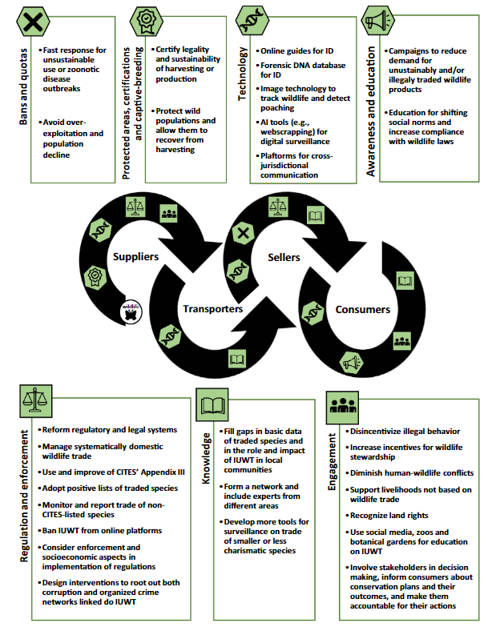

## Abstract

Illegal or unsustainable wildlife trade (IUWT) currently presents one of the most high-profile conservation challenges. There is no “one-size-fits-all” strategy, and a variety of disciplines and actors are needed for any counteractive approach to work effectively. Here, we detail common challenges faced when tackling IUWT, and we describe some available tools and technologies to curb and track IUWT (e.g. bans, quotas, protected areas, certification, captive-breeding and propagation, education and awareness). We discuss gaps to be filled in regulation, enforcement, engagement and knowledge about wildlife trade, and propose practical solutions to regulate and curb IUWT, paving the road for immediate action.